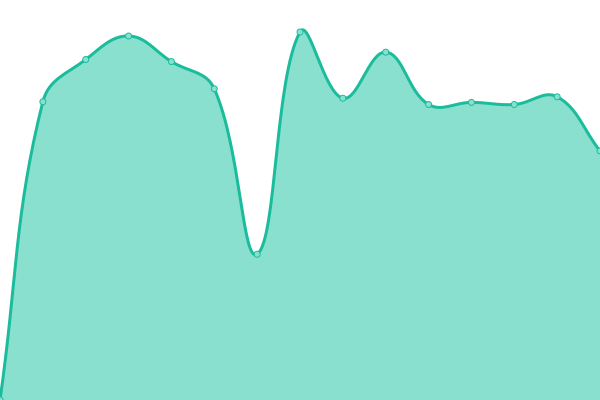
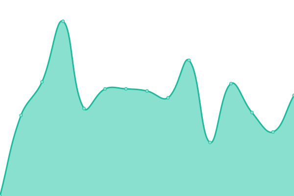

# [📈 Live Status](https://TripleCamera.github.io/osome-upptime): <!--live status--> **🟩 All systems operational**

This repository contains the open-source uptime monitor and status page for [TripleCamera](https://TripleCamera.github.io/osome-upptime), powered by [Upptime](https://github.com/upptime/upptime).

With [Upptime](https://upptime.js.org), you can get your own unlimited and free uptime monitor and status page, powered entirely by a GitHub repository. We use [Issues](https://github.com/TripleCamera/osome-upptime/issues) as incident reports, [Actions](https://github.com/TripleCamera/osome-upptime/actions) as uptime monitors, and [Pages](https://TripleCamera.github.io/osome-upptime) for the status page.

<!--start: status pages-->
<!-- This summary is generated by Upptime (https://github.com/upptime/upptime) -->
<!-- Do not edit this manually, your changes will be overwritten -->
<!-- prettier-ignore -->
| URL | Status | History | Response Time | Uptime |
| --- | ------ | ------- | ------------- | ------ |
|  [OSome](https://os.buaa.edu.cn) | 🟩 Up | [o-some.yml](https://github.com/TripleCamera/osome-upptime/commits/HEAD/history/o-some.yml) | 

 1961ms
     
 | 

<a href="https://TripleCamera.github.io/osome-upptime/history/o-some">90.59%</a>
    

|  [JumpServer](https://lab.os.buaa.edu.cn) | 🟩 Up | [jump-server.yml](https://github.com/TripleCamera/osome-upptime/commits/HEAD/history/jump-server.yml) | 

 2142ms
     
 | 

<a href="https://TripleCamera.github.io/osome-upptime/history/jump-server">90.60%</a>
    

|  [极狐 GitLab](https://git.os.buaa.edu.cn) | 🟩 Up | [git-lab.yml](https://github.com/TripleCamera/osome-upptime/commits/HEAD/history/git-lab.yml) | 

 3012ms
     
 | 

<a href="https://TripleCamera.github.io/osome-upptime/history/git-lab">90.61%</a>
    

<!--end: status pages-->

[**Visit our status website →**](https://TripleCamera.github.io/osome-upptime)

## 📄 License

- Powered by: [Upptime](https://github.com/upptime/upptime)
- Code: [MIT](./LICENSE) © [Anand Chowdhary](https://anandchowdhary.com), supported by [Pabio](https://pabio.com)
- Data in the `./history` directory: [Open Database License](https://opendatacommons.org/licenses/odbl/1-0/)
